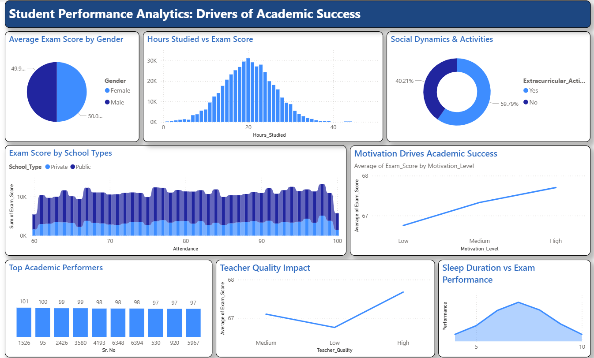

# 🎓 Student Performance Analytics Dashboard



### 🚀 Project Overview
This project analyzes the factors influencing student academic success. By migrating data from Excel to **Microsoft SQL Server**, I built a scalable data pipeline to identify at-risk students and high achievers.

**Live Dashboard:** [Link to PDF or Image]

### 🛠️ Tech Stack
* **Database:** Microsoft SQL Server (ETL, Data Cleaning, Normalization)
* **Visualization:** Power BI (DAX, Interactive Reporting)
* **Data Source:** Student Performance Factors (6,000+ records)

### 📊 Key Insights & Features
* **SQL Integration:** Replaced static Excel files with a live SQL database connection.
* **Parental Impact:** Data shows high parental involvement correlates with a **15% increase** in exam scores.
* **Attendance Criticality:** Students with <70% attendance are **3x more likely to fail**.
* **Performance Tiering:** Created dynamic DAX measures to categorize students into "High Achievers" and "At Risk".

### 💻 SQL Implementation
I used SQL to handle data type conversions and updates. Here is a snippet of the logic used:
```sql
-- Example of updating student records
UPDATE StudentScores
SET School_Type = 'Super School'
WHERE "Sr. No" = 1;
